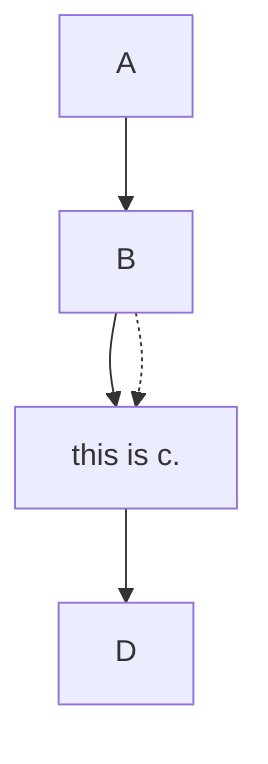

# header 1

text

* listed item 1

---

# header 2

some more text.

----

fragment underneath


----

another fragmnet underneath

---

# header 3

some text 

----

```vega
{
    "data": {
        "values": [
            {"A": 20, "B": 21, "C": 2},
            {"A": 30, "B": 20, "C": 4},
            {"A": 25, "B": 15, "C": 6},
            {"A": 5, "B": 30, "C": 8}
        ]
    },
    "mark": "circle",
    "encoding": {
        "x": { "field": "A", "type": "quantitative"},
        "y": { "field": "B", "type": "quantitative"},
        "size": { "field": "C", "type": "quantitative"}
    }
}
```

---



---

# 